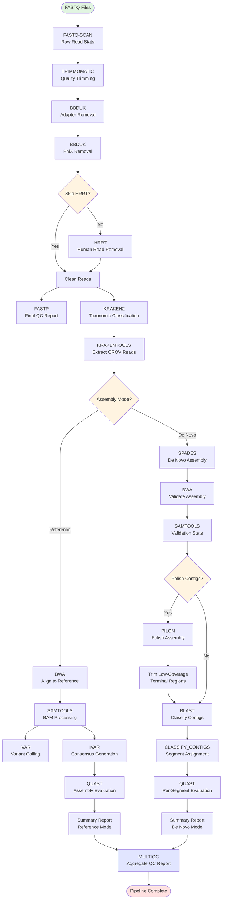

# Juno 🦟🦠🧬📊 - A Nextflow Pipeline for Oropouche Virus (OROV) Genome Assembly

Juno is designed for processing Illumina paired-end sequencing data for OROV genome assembly, supporting either reference-based or de novo assembly modes with comprehensive QC, taxonomic classification, and assembly evaluation.

#### Disclaimer: results of pipeline are intended for research use only and obtained by procedures that were not CLIA validated.

## ⚡ Usage
```bash
$ nextflow run juno.nf -profile singularity -params-file params.yaml
```

## 🐊 HiPerGator Usage
```bash
$ sbatch ./juno.sh
```

## Dependencies
- [Nextflow 25.04.0+](https://www.nextflow.io/docs/latest/install.html)
- [Singularity](https://docs.sylabs.io/guides/latest/user-guide/quick_start.html#quick-installation-steps) or [Docker](https://docs.docker.com/engine/install/)
- [Python 3.10+](https://docs.python.org/3/using/unix.html)
- [Slurm](https://slurm.schedmd.com/documentation.html) (This applies only if HiPerGator is used)

## Recommended Resource Allocation

Allocate **at least 16 CPU cores and 64 GB RAM** when using the viral Kraken2 Database, or **16 CPU cores and 200 GB RAM (or more)** when using larger Kraken2 databases.

## Configuration

#### 1. Clone this repository

```bash
$ git clone https://github.com/BPHL-Molecular/Juno.git
$ cd Juno
```

#### 2. Create a directory for input FASTQ files

```bash
$ mkdir fastq
# move or copy your FASTQ files into this directory
```
###### **Note:** FASTQ files must follow the Illumina naming format: `*_L001_R{1,2}_*.fastq.gz` (e.g., `sample_name_L001_R1_001.fastq.gz` and `sample_name_L001_R2_001.fastq.gz`)


#### 3. (Optional) Conda environment installation (Nextflow and Docker/Singularity/Apptainer must be installed on your system)

```bash
# Create conda environment
$ git clone https://github.com/BPHL-Molecular/Juno.git
$ cd Juno
$ conda create -n juno -c conda-forge python=3.10

# Activate and run environment using preferred profile
$ conda activate juno
$ nextflow run juno.nf -profile apptainer -params-file params.yaml
```


#### 4. Set required parameters:
**Important:** All pipeline parameters **must be set in the `params.yaml` file**. Make sure you edit this file to provide the correct paths and values before running the pipeline.

```yaml
# Input/Output paths
input_dir: "/path/to/fastq"
output_dir: "/path/to/juno_output"

# Assembly mode: 'reference' or 'denovo'
assembly_mode: "denovo"

# Kraken2 database path
kraken2_db: "/path/to/kraken2/database"

# Human read removal using NCBI's SRA human read removal tool (HRRT)
skip_hrrt: false

# Assembly polishing with Pilon (only used in de novo mode)
polish_contigs: true
```

You will need to download the kraken2/bracken viral database from the BenLangmead Index zone [link](https://benlangmead.github.io/aws-indexes/k2) for read classification.

Please be aware that using larger databases (e.g., Standard, PlusPF) will require significantly more memory resources. Ensure your system has sufficient memory allocated or adjust resource parameters in `nextflow.config` or `juno.sh` (if using Slurm/HiPerGator) accordingly.

The pipeline includes a step for removing human reads using [NCBI's SRA Human Read Removal Tool (HRRT)](https://ncbiinsights.ncbi.nlm.nih.gov/2023/02/02/scrubbing-human-sequences-sra-submissions/). This step is enabled by default, but please note that it significantly increases runtime due to the large container size and the intensive I/O involved in decompressing input files and recompressing cleaned outputs.

To skip this step, set: ```skip_hrrt: true```

Note: Skipping HRRT may be appropriate for:
- Non-human samples
- Pre-cleaned datasets
- Testing/development workflows

## Workflow Diagram



## Pipeline Assembly Modes
The pipeline runs in **one assembly mode at a time**, set via the `assembly_mode` parameter in `params.yaml`. Choose the mode appropriate for your data and objectives:

##### Reference-Based Mode:
Best for:
- Targeted amplicon sequencing data
- Samples with known, closely related reference genomes
- Detecting specific variants and generating consensus sequences
- Standard surveillance and outbreak investigations
- When high-quality reference genome is available

Outputs:
- Per-segment consensus sequences aligned to reference coordinates
- Variant calls (SNVs/indels)

##### De Novo Mode:
Best for:
- Untargeted or Metagenomic sequencing data
- Samples with divergent or unknown variants
- Discovery of novel sequences or reassortants
- When reference genome may not represent sample diversity
- Exploratory analysis of viral populations

Outputs:
- Assembled contigs
- Polished contigs (if polishing contigs was enbaled)
- Contigs classified by genome segment (L, M, S)

## 📂 Output Structure

### Reference Mode
```
output_dir/
├── fastq_scan/          # Raw read statistics
├── dehosted/            # Cleaned reads (if HRRT enabled)
├── trimmomatic/         # Trimmed reads
├── bbduk/               # Adapter and PhiX removal statistics
│   ├── bbduk_adapters/  # Adapter removal outputs
│   └── bbduk_phix/      # PhiX removal outputs
├── fastp/               # Final QC reports
├── kraken2/             # Classification results
├── krakentools/         # Filtered OROV reads
├── alignments/          # SAM/BAM files & indices
├── stats/               # Alignment statistics (coverage, depth, flagstat, markdup)
├── variants/            # Variant calls (iVar)
├── consensus/           # Consensus sequences (iVar)
├── quast/               # Assembly metrics
├── multiqc/             # Combined QC report
└── summary_report.tsv   # Summary report for all samples
```

### De Novo Mode
```
output_dir/
├── fastq_scan/          # Raw read statistics
├── dehosted/            # Cleaned reads (if HRRT enabled)
├── trimmomatic/         # Trimmed reads
├── bbduk/               # Adapter and PhiX removal statistics
│   ├── bbduk_adapters/  # Adapter removal outputs
│   └── bbduk_phix/      # PhiX removal outputs
├── fastp/               # Final QC reports
├── kraken2/             # Classification results
├── krakentools/         # Filtered OROV reads
├── spades/              # SPAdes assembly outputs
├── blast/               # BLAST database and results
│   ├── blast_db/        # BLAST reference database files
│   └── sample_id/       # Per-sample BLAST results
├── pilon/               # Polished assemblies (if polish_contigs enabled)
│   └── sample_id/       # Per-sample Pilon outputs
├── trimmed_contigs/     # Terminal-trimmed contigs (if polish_contigs enabled)
├── samtools/            # Validation alignment statistics
│   └── sample_id/       # Per-sample validation BAM files and stats
├── assemblies/          # Classified contigs by genome segment
│   └── sample_id/       # Per-sample directories
│       ├── sample_L.fasta
│       ├── sample_M.fasta
│       ├── sample_S.fasta
│       ├── sample_unassigned.fasta
│       └── sample_classification_summary.txt
├── quast/               # Assembly metrics (per segment)
├── multiqc/             # Combined QC report
└── summary_report.tsv   # Summary report for all samples
```

## Assembly Quality Status Legend (summary_report.tsv)

#### Reference Mode QC Criteria
- PASS: Coverage ≥90% AND depth ≥15x AND "N" bases ≤5%
- PASS_W_HIGH_N_BASES: Coverage ≥90% AND depth ≥15x BUT "N" bases >5%
- FAIL: Coverage <90% OR depth <15x

#### De Novo Mode Assembly Status
- ASSEMBLED: Contigs successfully assembled with largest contig within 90-150% of quality threshold (length)
- FRAGMENTED: Contigs exist but largest contig is outside the 90-150% quality threshold (length)
- NO_ASSEMBLY: No contigs assembled or classified for segment

## Tools Used

Juno is made possible thanks to these bioinformatics tools:

- [`fastq-scan`](https://github.com/rpetit3/fastq-scan) - raw read statistics
- [`trimmomatic`](https://github.com/usadellab/Trimmomatic) - quality trimming
- [`bbduk`](https://github.com/bbushnell/BBTools) - adapter and PhiX removal
- [`sra-human-scrubber (HRRT)`](https://github.com/ncbi/sra-human-scrubber) - human read removal
- [`fastp`](https://github.com/OpenGene/fastp) - final QC report
- [`kraken2`](https://github.com/DerrickWood/kraken2) - taxonomic classification
- [`krakentools`](https://github.com/jenniferlu717/KrakenTools) - extract classified reads
- [`bwa`](https://github.com/lh3/bwa) - read alignment
- [`samtools`](https://github.com/samtools/samtools) - SAM/BAM processing
- [`ivar`](https://github.com/andersen-lab/ivar) - variant calling & consensus generation
- [`spades`](https://github.com/ablab/spades) - de novo genome assembly
- [`pilon`](https://github.com/broadinstitute/pilon) - assembly polishing
- [`blast`](https://blast.ncbi.nlm.nih.gov/doc/blast-help/) - contig classification
- [`quast`](https://github.com/ablab/quast) - assembly evaluation
- [`multiqc`](https://github.com/MultiQC/MultiQC) - aggregate QC reporting

## 🐛 Troubleshooting
**Pipeline Errors:**
   Check Nextflow execution logs in .nextflow.log

**Low Coverage Regions (Reference Mode):**
   Regions with low coverage (<10x) will be filled with 'N' in consensus sequences.

**De Novo Assembly Issues:**
   - Low contig counts may indicate insufficient OROV reads
   - Check classification summary for unassigned contigs
   - BLAST identity/coverage thresholds: ≥85% identity, ≥70% coverage
   - **FRAGMENTED** status indicates assembly exists but quality criteria not met (largest contig outside 90-150% of reference length)

## 🤝 Contributing
We welcome contributions to make Juno better! Feel free to open issues or submit pull requests to suggest any additional features or enhancements!

## 📧 Contact
**Email**: bphl-sebioinformatics@flhealth.gov

## ⚖️ License
Juno is licensed under the [MIT License](LICENSE).


