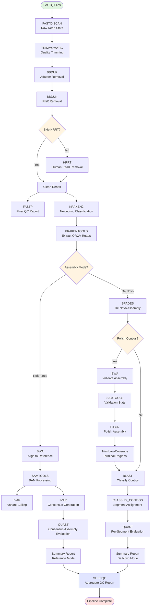

# Juno 🦟🦠🧬📊 - A Nextflow Pipeline for Oropouche Virus (OROV) Genome Assembly

Juno is designed for processing Illumina paired-end sequencing data for OROV genome assembly, supporting both reference-based and de novo assembly modes with comprehensive QC, taxonomic classification, and assembly evaluation.

## ⚡ Usage
```bash
$ nextflow run juno.nf -profile singularity -params-file params.yaml
```

## 🐊 HiPerGator Usage
```bash
$ sbatch ./juno.sh
```

## 📦 Dependencies
- [Nextflow 23.04.0+](https://www.nextflow.io/docs/latest/install.html)
- [Singularity](https://docs.sylabs.io/guides/latest/user-guide/quick_start.html#quick-installation-steps) or [Docker](https://docs.docker.com/engine/install/)
- [Python 3.6+](https://docs.python.org/3/using/unix.html)
- [Slurm](https://slurm.schedmd.com/documentation.html) (This applies only if HiPerGator is used)

## ⚙️ Configuration

#### 1. Clone this repository

```bash
git clone https://github.com/BPHL-Molecular/Juno.git
cd Juno
```

#### 2. Create a directory for Input FASTQ Files

```bash
mkdir fastq
# move or copy your FASTQ files into this directory
```
**Note:** FASTQ files must follow the Illumina naming format: `*_L001_R{1,2}_*.fastq.gz` (e.g., `sample_name_L001_R1_001.fastq.gz` and `sample_name_L001_R2_001.fastq.gz`)

#### 3. Set required parameters:
**Important:** All pipeline parameters **must be set in the `params.yaml` file**. Make sure you edit this file to provide the correct paths and values before running the pipeline.

```yaml
# Input/Output paths
input_dir: "/path/to/fastq"
output_dir: "/path/to/juno_output"

# Assembly mode: 'reference' or 'denovo'
assembly_mode: "denovo"

# Kraken2 database path
kraken2_db: "/path/to/kraken2/database"

# Human read removal using NCBI's SRA human read removal tool (HRRT)
skip_hrrt: false

# Assembly polishing with Pilon (only used in de novo mode)
polish_contigs: false
```

You will need to download the kraken2/bracken viral database from the BenLangmead Index zone [link](https://benlangmead.github.io/aws-indexes/k2) for read classification.

The pipeline includes a step for removing human reads using [NCBI's SRA Human Read Removal Tool (HRRT)](https://ncbiinsights.ncbi.nlm.nih.gov/2023/02/02/scrubbing-human-sequences-sra-submissions/). This step is enabled by default, but please note that it significantly increases runtime due to the large container size and the intensive I/O involved in decompressing input files and recompressing cleaned outputs.

To skip this step and use raw reads directly, set: ```skip_hrrt: true```

Note: Skipping HRRT may be appropriate for:
- Non-human samples
- Pre-cleaned datasets
- Testing/development workflows

## Workflow Diagram



## Pipeline Assembly Modes

### Quality Control (Both Modes)
1. **Read Statistics & Preprocessing**
   - Raw read statistics - [`fastq-scan`](https://github.com/rpetit3/fastq-scan)
   - Adapter and quality trimming - [`trimmomatic`](https://github.com/usadellab/Trimmomatic)
   - Adapter removal - [`bbduk`](https://jgi.doe.gov/data-and-tools/software-tools/bbtools/)
   - PhiX removal - [`bbduk`](https://jgi.doe.gov/data-and-tools/software-tools/bbtools/)
   - Human Read Removal (optional) - [`sra-human-scrubber`](https://github.com/ncbi/sra-human-scrubber)
   - Final QC report - [`fastp`](https://github.com/OpenGene/fastp)

2. **Taxonomic Classification**
   - Read classification - [`kraken2`](https://github.com/DerrickWood/kraken2)
   - Filter classified OROV reads - [`krakentools`](https://github.com/jenniferlu717/KrakenTools)

### Reference-Based Assembly
3. **Reference-Based Assembly**
   - Reference alignment - [`bwa`](https://github.com/lh3/bwa)
   - SAM/BAM processing - [`samtools`](https://github.com/samtools/samtools)
   - Variant calling & consensus - [`ivar`](https://github.com/andersen-lab/ivar)
4. **Quality Assessment**
   - Assembly evaluation - [`quast`](https://github.com/ablab/quast)
5. **Aggregate and Summarize Results**
   - Aggregate results from bioinformatics analyses - [`multiqc`](https://github.com/MultiQC/MultiQC)
   - Summary report generation with QC pass/fail status
###### Please see the [notes](https://github.com/BPHL-Molecular/Juno/tree/main/references) on the reference genomes used in this workflow.


### De Novo Assembly Mode
3. **De Novo Assembly**
   - Genome assembly - [`spades`](https://github.com/ablab/spades)
   - Reference database creation - [`makeblastdb`](https://blast.ncbi.nlm.nih.gov/doc/blast-help/downloadblastdata.html)
   - Contig classification - [`blastn`](https://blast.ncbi.nlm.nih.gov/doc/blast-help/)
   - Segment assignment and formatting
4. **Assembly Polishing (Optional)**
   - Contig validation alignment - [`bwa`](https://github.com/lh3/bwa)
   - BAM processing - [`samtools`](https://github.com/samtools/samtools)
   - Polish assembly - [`pilon`](https://github.com/broadinstitute/pilon)
   - Trim low-coverage terminals - Custom Python script
5. **Quality Assessment**
   - Assembly evaluation - [`quast`](https://github.com/ablab/quast) (per segment)
6. **Aggregate and Summarize Results**
   - Aggregate results from bioinformatics analyses - [`multiqc`](https://github.com/MultiQC/MultiQC)
   - Summary report generation with assembly status

## 📂 Output Structure

### Reference Mode
```
output_dir/
├── fastq_scan/          # Raw read statistics
├── dehosted/            # Cleaned reads (if HRRT enabled)
├── trimmomatic/         # Trimmed reads
├── bbduk/               # Adapter and PhiX removal statistics
│   ├── bbduk_adapters/  # Adapter removal outputs
│   └── bbduk_phix/      # PhiX removal outputs
├── fastp/               # Final QC reports
├── kraken2/             # Classification results
├── krakentools/         # Filtered OROV reads
├── alignments/          # SAM/BAM files & indices
├── stats/               # Alignment statistics (coverage, depth, flagstat, markdup)
├── variants/            # Variant calls (iVar)
├── consensus/           # Consensus sequences (iVar)
├── quast/               # Assembly metrics
├── multiqc/             # Combined QC report
└── summary_report.tsv   # Summary report for all samples
```

### De Novo Mode
```
output_dir/
├── fastq_scan/          # Raw read statistics
├── dehosted/            # Cleaned reads (if HRRT enabled)
├── trimmomatic/         # Trimmed reads
├── bbduk/               # Adapter and PhiX removal statistics
│   ├── bbduk_adapters/  # Adapter removal outputs
│   └── bbduk_phix/      # PhiX removal outputs
├── fastp/               # Final QC reports
├── kraken2/             # Classification results
├── krakentools/         # Filtered OROV reads
├── spades/              # SPAdes assembly outputs
├── blast/               # BLAST database and results
│   ├── blast_db/        # BLAST reference database files
│   └── sample_id/       # Per-sample BLAST results
├── pilon/               # Polished assemblies (if polish_contigs enabled)
│   └── sample_id/       # Per-sample Pilon outputs
├── trimmed_contigs/     # Terminal-trimmed contigs (if polish_contigs enabled)
├── samtools/            # Validation alignment statistics
│   └── sample_id/       # Per-sample validation BAM files and stats
├── assemblies/          # Classified contigs by genome segment
│   └── sample_id/       # Per-sample directories
│       ├── sample_L.fasta
│       ├── sample_M.fasta
│       ├── sample_S.fasta
│       ├── sample_unassigned.fasta
│       └── sample_classification_summary.txt
├── quast/               # Assembly metrics (per segment)
├── multiqc/             # Combined QC report
└── summary_report.tsv   # Summary report for all samples
```

## 📋 Summary Report Metrics

### Reference Mode
- Sample and reference identifiers
- Raw read counts
- Cleaned read counts
- Classification read counts
- Mapping statistics
- Coverage metrics
- Variant counts
- Assembly quality metrics
- QC status (PASS/FAIL/PASS_W_HIGH_N_BASES)

### De Novo Mode
- Sample identifier and segment
- Raw read counts
- Cleaned read counts
- Classification read counts
- Contig counts per segment (L, M, S)
- Assembly metrics (largest contig, reference length, NA50)
- BLAST quality metrics (identity, coverage)
- Validation statistics (mapped reads, mapping percentage, mean depth per segment)
- Assembly status (ASSEMBLED/FRAGMENTED/NO_ASSEMBLY)

## 🔍 Assembly Quality Assessment

### Reference Mode QC Criteria
- **PASS**: Coverage ≥90% AND depth ≥15x AND N-bases ≤5%
- **PASS_W_HIGH_N_BASES**: Coverage ≥90% AND depth ≥15x BUT N-bases >5%
- **FAIL**: Coverage <90% OR depth <15x

### De Novo Mode Assembly Status
- **ASSEMBLED**: Contigs successfully assembled with largest contig 90-150% of reference length
- **FRAGMENTED**: Contigs exist but largest contig is outside the 90-150% quality threshold
- **NO_ASSEMBLY**: No contigs assembled or classified for segment

## Advanced Options

### Assembly Polishing (De Novo Mode Only)

The pipeline supports optional assembly polishing using Pilon to improve contig quality. When enabled:
1. Reads are aligned back to assembled contigs for validation
2. Pilon corrects small errors and improves consensus accuracy
3. Terminal low-coverage regions are automatically trimmed

To enable polishing, set in `params.yaml`:
```yaml
polish_contigs: true
```

**Note:** Polishing increases runtime but may improve assembly accuracy, particularly for low-coverage terminal regions.

## 🐛 Troubleshooting
**Pipeline Errors:**
   Check Nextflow execution logs in .nextflow.log

**Low Coverage Regions (Reference Mode):**
   Regions with low coverage (<10x) will be filled with 'N' in consensus sequences.

**De Novo Assembly Issues:**
   - Low contig counts may indicate insufficient OROV reads
   - Check classification summary for unassigned contigs
   - BLAST identity/coverage thresholds: ≥85% identity, ≥70% coverage
   - **FRAGMENTED** status indicates assembly exists but quality criteria not met (largest contig outside 90-150% of reference length)

## 🤝 Contributing
We welcome contributions to make Juno better! Feel free to open issues or submit pull requests to suggest any additional features or enhancements!

## 📧 Contact
**Email**: bphl-sebioinformatics@flhealth.gov

## ⚖️ License
Juno is licensed under the [MIT License](LICENSE).
